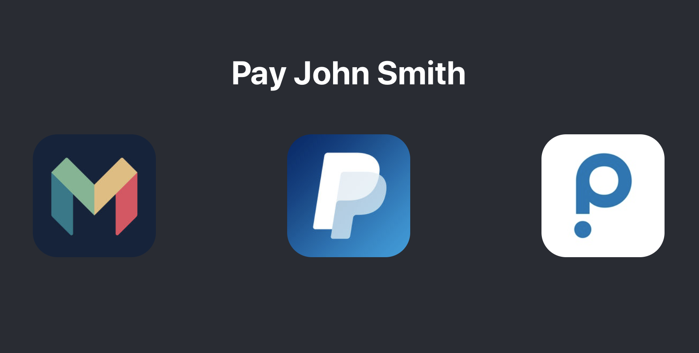

# PayMate

Create a custom payment page with links to all your payment providers to receive money.

## Features

- Create shareable link to receive payments
- Add your payment providers/banks to your payment page
- Friends and customers and choose their preferred way to pay
- Add amount by adding `/<amount>` to the end of the url - e.g. `/22.50`

> Example user page

